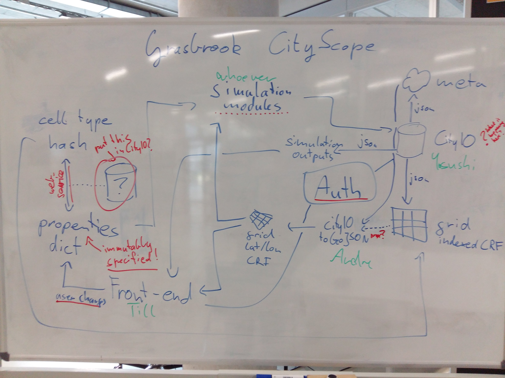

# GRACIO
Repo for documentation and specification of GRACIO/Grasbrook CityScopes


## Description

This page is for collecting all overarching specification and documentation of the combined but dispersed endeavours of building a CityScope for the Grasbrook competition. Interfaces of the infrastructures are defined here, as well as general to-dos and responsibilities.

## Infrastracture



[CityIO](https://github.com/CityScope/CS_CityIO) is the central point of knowledge. All data is stored there. [table data](https://cityio.media.mit.edu/api/table/grasbrook/)
the front-end and some simulation models require the grid to be represented as geodata (GeoJSON). [CityIO_to_geoJSON](https://github.com/andredaa/city_io_to_geojson) does the conversion from table meta parameters (lat, lon, number of cells/rows, cell dimensions) to a GeoJSON containing the right set of quadruatic polygons.

## Interfaces

- grid as array of ```{type:int, rotation:int}```, index reference frame
- grid as GeoJSON, geo reference frame
- simulation outpus as various (preferably GeoJSON?)

## Cell Properties
Cells are represented in CityIO by their array index, a rotation (int) and a type (int).
Types can be a big number of (almost) arbitrary property combinations (i.e. ```isBuilding=true``` and ```numStories=4```). These properties might have conditions to be applicable (i.e. numStores is only relevant for buildings).
The mapping from the integer type stored in the grid to the actual dictionary of properties set should be represented by hashing. That means every unique combination of properties has a unique hash.

That means we need:
- a database storing property dictionaries to the hashes
- a service translating hashes to dictionaries and vice-versa, so other software components (front-end, simulation modules) don't have to know the database structure or hashing method

Also, the names and the possible values and the conditions of properties have to be specifically defined and immutable! Otherwise the front-end doesn't know what UI-elements to display and the simulation models don't know what values they can work with.

[Draft for possible properties](files/properties.csv)

## To Do

### specification
- make a more pretty schematic
- define user-changeble parameters (see "Cell Properties" above)
- figure out architecture for hashing properties
- decide on wether GeoJSON grids contain properties or if they should be obtained from the grid array instead (reasoning: geoJSONs get really big, might make sense to only create once at startup and get/send data (cell types) only on index-referenced-grid basis)

### property storage
- where do be put this? CityIO?
- decide on hashing procedure
- define unified translation service

### front-end
by Till
- select grid cells
- change params for grid cells
- previous states of grid?
- trigger simulations

### CityIO
by Yasushi
- one dataset for each user
- authenticating users
- keep previous states of grid?
- prevent people from overwriting stuff they should not be changing. I.e. user only changes grid cell types, simulation modules only write their output, nowhere else...

### Simulation modules
- define required parameters
- define inferred and assumed parameters
- make noise simulation interface nicely (Andre)
- write more
- how to trigger these to run?

### Open Questions
- Do we provide import tools?

### Deployment
- User manual
- host the front-end
- host the back-end
- distribute access codes